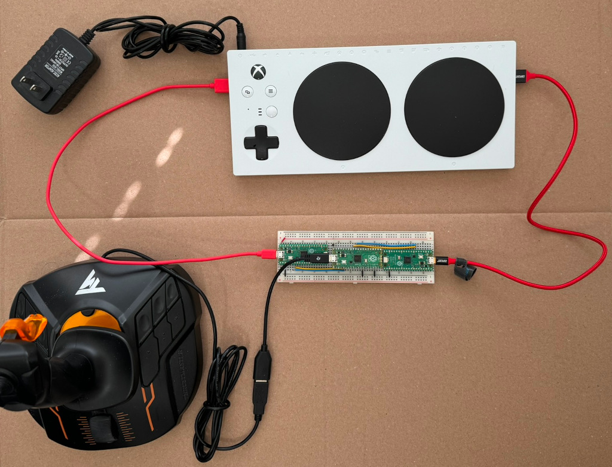
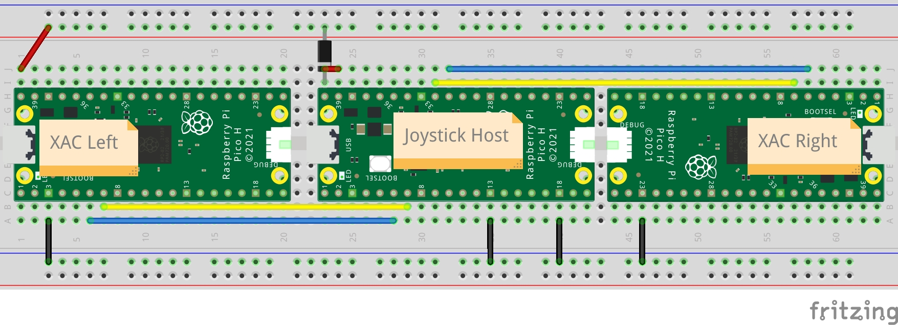
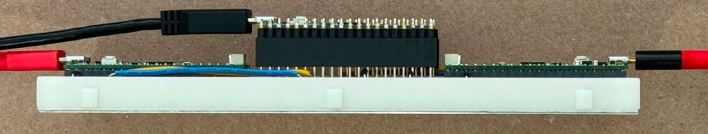
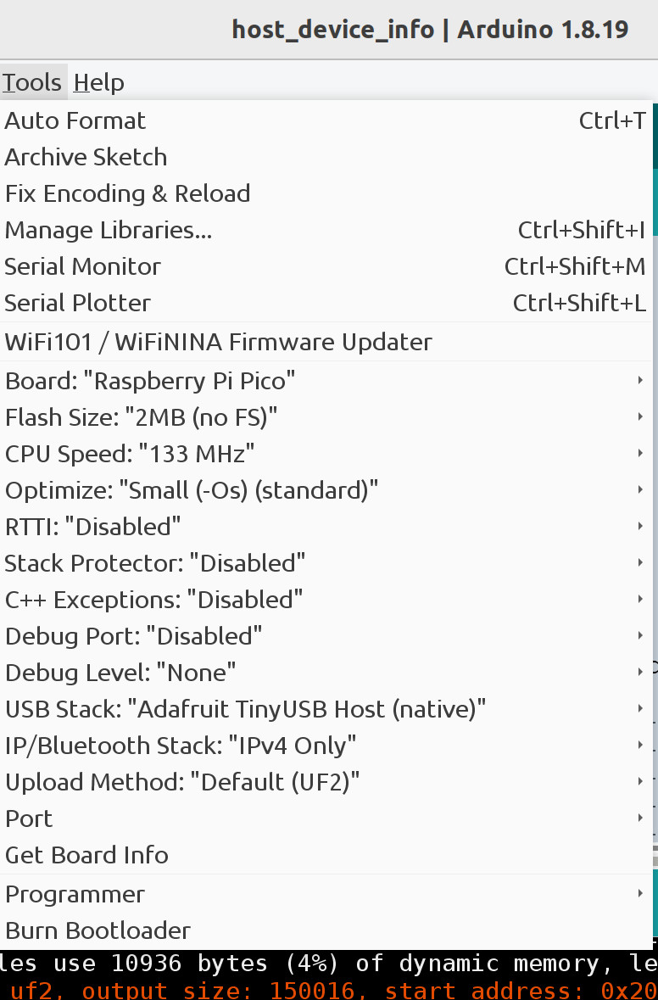

# Xbox Adaptive Controller Flight Joystick Pico Style

The xac_onehand_pico project connects a USB flight stick such as a Logitech
Extreme 3D Pro to both USB ports on an Xbox Adaptive Controller (XAC). This
allows one handed gamers to play two joystick games. The Logitech Extreme 3D
Pro, the Logitech X52 H.O.T.A.S., and the Thrustmaster T.16000M FCS joysticks
are supported. No soldering is needed.

This project was inspired by an older XAC joystick splitter project.

Note: This project does not use the Pico-PIO-USB library because the
Pico-PIO-USB library does not work for the Thrustmaster flight stick. See the
related project https://github.com/touchgadget/xac_onehand for a simpler build
but no support for the Thrustmaster flight stick.

The 5V 2A wall adapter for the XAC is required. And unlike in the photo, it
must be plugged into a wall power socket. Without the wall adapter, the XAC
supplies only 100 mA to its USB host ports. The Pico boards and the big
joystick draw more than 100mA. With the wall adapter, the XAC supplies up to
500 mA per port which is more than enough for this project.

## Hardware

* 3 X Raspberry Pi Pico H - Pico with Headers Soldered
* 2 X 20 pin stacking headers
* 1 X breadboard
* 1 X USB micro OTG Host Cable
* 2 X USB micro cable
* 1 X 1N5817 Schottky diode

The three Pico boards are named: Joystick_Host, XAC_Left, and XAC_Right.

Joystick_Host - The middle Pico board is the USB host for the flight joystick.
The USB OTG cable connects the flight stick to the Pico USB port in native USB
host mode. This board is powered from the XAC left USB port. The diode prevents
accidental back powering of the USB port. The small jumper wire between VBUS
and VSYS bypasses a diode on the board because the external diode makes it
unneeded. This board communicates with the two other boards with I2C.

XAC_Left - The left Pico board plugs into the XAC left USB port. The flight
stick X and Y axes control the XAC left thumb stick. The left XAC USB port
powers this board and the Joystick_Host board.

XAC_Right - The right Pico board plugs into the XAC right USB port. The
flight stick Z/twist axis controls the right thumb stick X axis. The
flight stick hat switch forward and backward control the right thumb
stick Y axis.

The stacking headers raise the middle Pico board so its USB port is accessible.
An alternative to using stacking headers is to build with three half size
breadboards, one for each Pico.

## Pico firmware

Download the UF2 files in the uf2 folder to your PC.

Load i2c_demo_rx.ino.rpipico.uf2 into the XAC_Left and XAC_Right Pico boards.

Load xac_onehand_pico.ino.rpipico.uf2 into the Joystick_Host Pico board.

## Building the code

The project was tested using Arduino IDE 1.8.19.

Install the Pi Pico RP2040 board support package according to the following
instructions.

https://github.com/earlephilhower/arduino-pico?tab=readme-ov-file#installing-via-arduino-boards-manager

Install the "Adafruit TinyUSB Library" using the IDE library manager.

The only non-default option is the "USB Stack" option is set to "Adafruit
TinyUSB Host (native)". This configures the Pico RP2040 USB OTG controller for
USB host mode.

The i2c_demo_rx.ino.rpipico.uf2 is built from from
https://github.com/touchgadget/flight_stick_tinyusb/tree/main/examples/i2c_demo_rx.

## References

* https://datasheets.raspberrypi.com/pico/Pico-R3-A4-Pinout.pdf
* https://datasheets.raspberrypi.com/pico/pico-datasheet.pdf, Section 4.5 Powering Pico
